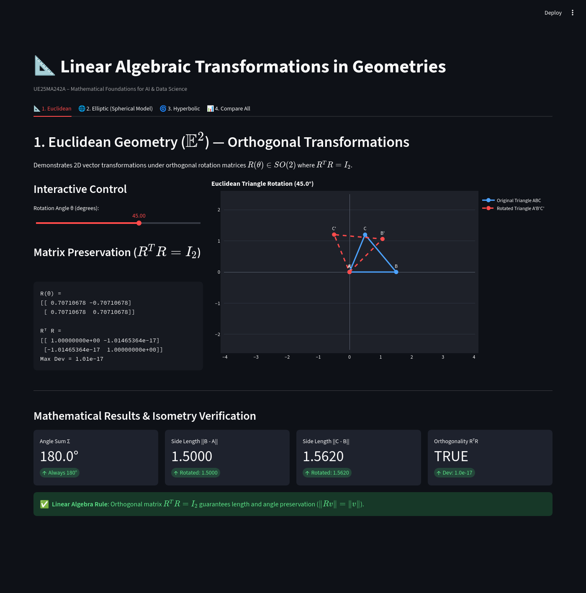
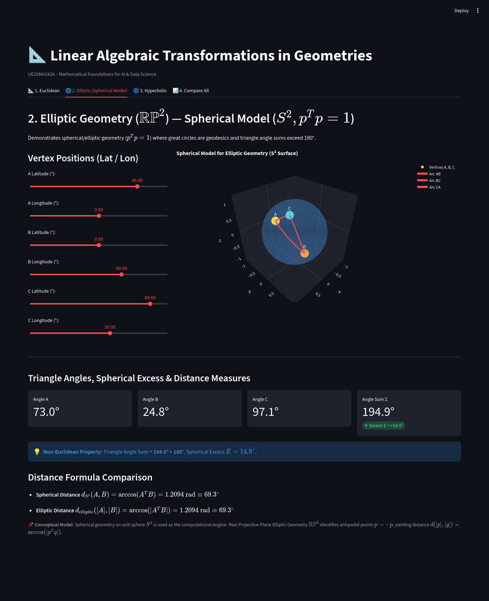
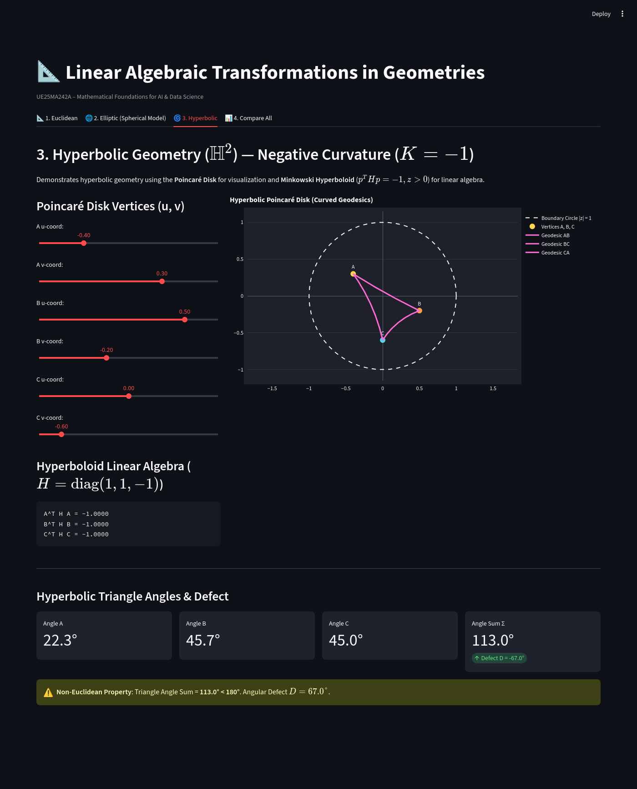
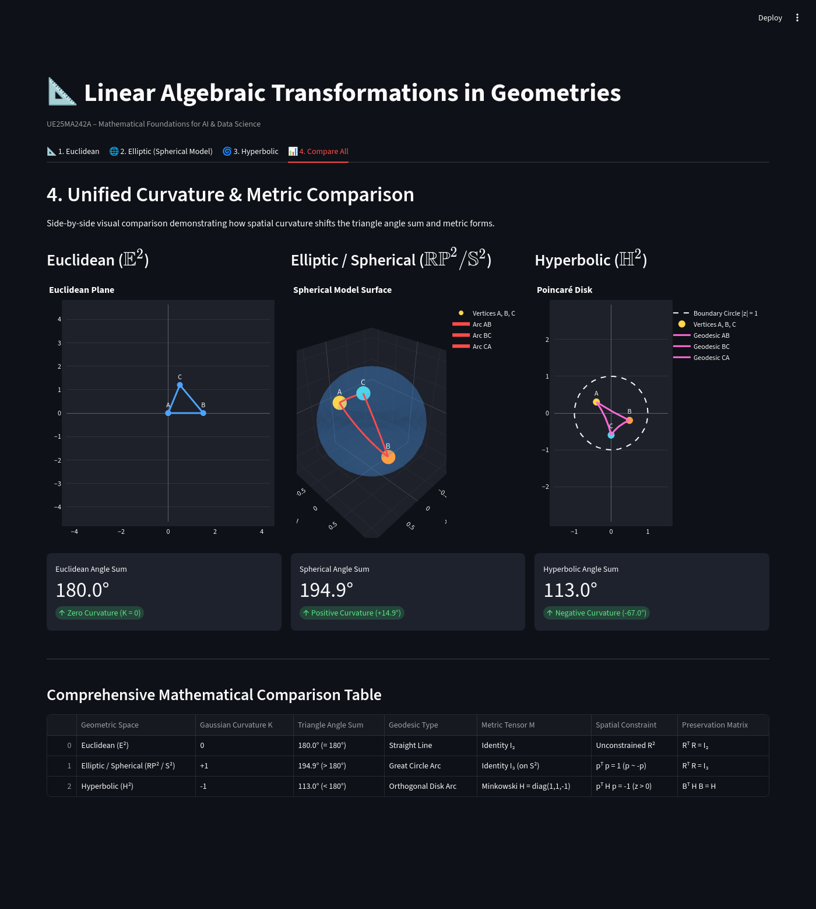

# Linear Algebraic Transformations in Euclidean and Non-Euclidean Geometries

A linear algebra project exploring how spatial curvature transforms geometric structures. Non-Euclidean geometry serves as the core application domain, comparing **Euclidean** ($\mathbb{E}^2$), **Elliptic** ($\mathbb{RP}^2$, using the 3D unit sphere $S^2$ as a concrete computational model), and **Hyperbolic** ($\mathbb{H}^2$) geometries through vector spaces, matrix preservation conditions, bilinear forms, and triangle angle properties.

---

## 🚀 Live Demo

[Open the Interactive Streamlit App](https://non-euclidean-geometry-mfad.streamlit.app/)

*(Note: To deploy to Streamlit Community Cloud, connect repository `riggid/Non-Euclidean-Geometry`, main branch, with main file `app.py`)*

---

## What the Project Demonstrates

### Linear Algebra Pipeline:
$$\text{Vectors} \longrightarrow \text{Matrices / Bilinear Forms} \longrightarrow \text{Transformations} \longrightarrow \text{Preserved Invariants} \longrightarrow \text{Geometric Curvature}$$

### Core Concepts Implemented:
- **Vectors & Vector Spaces**: $\mathbb{R}^2$ and $\mathbb{R}^3$ representation of spatial points.
- **Inner Products & Norms**: Standard dot product $u^T v$, $L2$ vector norm $\|v\|$, and Minkowski product $u^T H v$.
- **Matrix-Vector Multiplication**: Linear transformations $v' = R v$.
- **Orthogonal Matrices & Rotation Matrices**: $R(\theta) \in SO(2)$ and $SO(3)$ satisfying $R^T R = I$.
- **Vector Projections**: Orthogonal projection $\text{proj}_u(v) = \left(\frac{v^T u}{u^T u}\right) u$.
- **Bilinear & Quadratic Forms**: Metric signature $M$, quadratic constraint $x^T M x = k$.
- **Matrix Preservation Conditions**: Isometric condition $R^T M R = M$.
- **Elliptic / Spherical Geometry**: Positive curvature, unit sphere $p^T p = 1$, great-circle geodesics, and antipodal point identification $p \sim -p$.
- **Hyperbolic Geometry**: Negative curvature, Minkowski hyperboloid model $p^T H p = -1, z > 0$ with $H = \text{diag}(1,1,-1)$, Lorentz boosts $B^T H B = H$, and 2D Poincaré disk projection.

---

## The Three Geometries

### 1. Euclidean ($\mathbb{E}^2$)
- **Vector Space**: $\mathbb{R}^2$, unconstrained space.
- **Preservation Condition**: $R^T R = I_2$ (Orthogonal matrices).
- **Defining Property**: Triangle Angle Sum $\Sigma = 180.0^\circ$. Lengths and angles preserved under rotation $\|Rv\| = \|v\|$.

### 2. Elliptic (Spherical Model $\mathbb{S}^2 / \mathbb{RP}^2$)
- **Surface Model**: Unit sphere $S^2 = \{p \in \mathbb{R}^3 : p^T p = 1\}$. Real Projective Plane $\mathbb{RP}^2$ identifies antipodal points $p \sim -p$.
- **Preservation Condition**: $R^T R = I_3$ ($SO(3)$ rotations preserve $p^T p = 1$).
- **Distances**:
  - Spherical Distance: $d_{S^2}(p, q) = \arccos(p^T q)$
  - Elliptic Distance: $d_{\text{elliptic}}([p], [q]) = \arccos(|p^T q|)$
- **Defining Property**: Triangle Angle Sum $\Sigma > 180.0^\circ$ (Spherical Excess $E = \Sigma - 180^\circ > 0$).

### 3. Hyperbolic ($\mathbb{H}^2$)
- **Hyperboloid Model**: Upper sheet of hyperboloid $p^T H p = -1, z > 0$ in Minkowski 3-space with metric $H = \text{diag}(1, 1, -1)$.
- **Preservation Condition**: $B^T H B = H$ (Lorentz boost transformations).
- **Visualization**: 2D Poincaré disk $(u,v) = \left(\frac{x}{1+z}, \frac{y}{1+z}\right)$ with curved geodesics orthogonal to boundary circle.
- **Defining Property**: Triangle Angle Sum $\Sigma < 180.0^\circ$ (Angular Defect $D = 180^\circ - \Sigma > 0$).

---

## Screenshots

### Euclidean Geometry



### Elliptic Geometry



### Hyperbolic Geometry



### Compare All Three Geometries



---

## Architecture & How It Works

```
app.py  <-- Interactive Streamlit & Plotly Dashboard
   ↓
geometry_linear_algebra/
   ├── linalg.py          # Vector inner products, norm, Minkowski form u^T H v, R^T M R check
   ├── euclidean.py       # 2D rotation matrix R(theta), 2D triangle angles & projections
   ├── spherical.py       # 3D unit sphere vectors, SO(3) rotations, elliptic distance arccos(|p^T q|)
   ├── hyperbolic.py      # Minkowski hyperboloid p^T H p = -1, Lorentz boost, Poincaré projection & geodesics
   └── visualization.py   # Interactive Plotly rendering for 2D plane, 3D sphere, and Poincaré disk
```

- **`app.py`**: Modern, reactive 4-tab Streamlit dashboard.
- **`linalg.py`**: Pure linear algebra operations and matrix preservation checks.
- **`euclidean.py`**: Implements 2D Euclidean linear algebra transformations and triangle properties.
- **`spherical.py`**: Models the 3D unit sphere, great-circle arcs via SLERP, and spherical/elliptic distances.
- **`hyperbolic.py`**: Implements Minkowski 3-space, Lorentz boosts, hyperboloid geodesics, and Poincaré disk projection.
- **`visualization.py`**: Generates interactive 2D/3D Plotly graphics.

---

## Running Locally

### Install Dependencies
```bash
uv sync
```

### Run the Interactive Streamlit Application
```bash
uv run streamlit run app.py
```

### Open the Viva Jupyter Notebook Laboratory
```bash
uv run jupyter notebook notebooks/mathematics.ipynb
```
